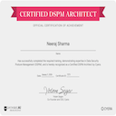
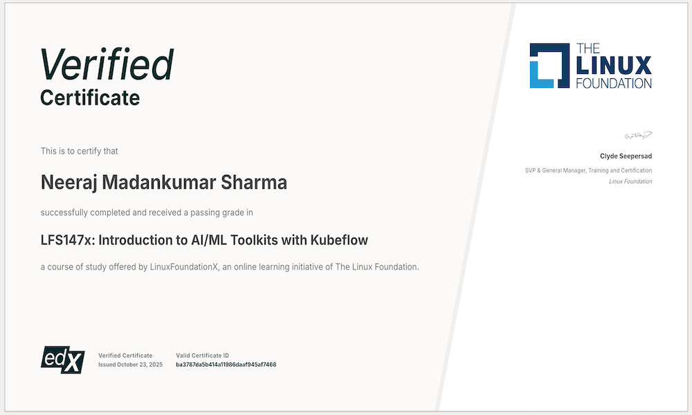
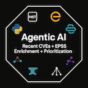

  

|         |                                    |        |                                      |        |              |
|----------|------------------------------------|--------|--------------------------------------|--------|--------------|
 Linkedin | https://www.linkedin.com/in/neeraj | Email  | mail4neeraj@gmail.com                | Mobile | 669-241-2101 |

# Neeraj Sharma

## Principal Platform Engineer | DevSecOps, Kubernetes, CI/CD | AI Infrastructure & Cloud Security | Kubeflow, DSPM

I design and operate secure cloud platforms that power production systems and AI/ML workloads.

My work focuses on building Kubernetes-based platforms that combine DevSecOps automation, CI/CD pipelines, and strong cloud security practices. I build scalable platform foundations that enable engineering teams to ship reliable software safely and quickly.

Key areas of focus:
• Platform engineering and Kubernetes-based infrastructure
• DevSecOps, CI/CD pipelines, and cloud-native automation
• Cloud security and data protection for distributed systems
• AI/ML platform infrastructure including Kubeflow
• Data Security Posture Management (DSPM) for modern platforms

I am particularly interested in building secure AI-ready cloud platforms where platform engineering, security, and machine learning infrastructure converge.

This page serves as a consolidated reference for recruiters and hiring managers, spanning experience, technical focus, and applied work beyond a résumé.

#### Experience Snapshot

[Neeraj_Sharma_Experience_Snapshot.pdf](https://github.com/neeraj-sharma-0/neeraj-sharma-0/blob/main/Neeraj_Sharma_Experience_Snapshot.pdf)

#### Complete Resume

[neeraj-sharma-resume.pdf](https://github.com/hardly-soft/neeraj-sharma/blob/main/neeraj-sharma-resume.pdf)  

## Representative Applied Work

#### ePortfolios:

- UT Austin
  - [PGDSBA ePortFolio](https://www.mygreatlearning.com/eportfolio/neeraj-sharma11)
  - [AIDL ePortFolio](https://www.mygreatlearning.com/eportfolio/neeraj-sharma13)

### Data Engineering & Analytics Correctness
- Authored a technical deep dive on Pandas DataFrame ingestion semantics, demonstrating how dtype decisions at ingestion propagate through analytics pipelines,
  ([Article](https://www.linkedin.com/posts/neeraj_pandas-dataframe-ingestion-dtypes-visual-activity-7411451068825567232-54Jc))

### Agentic AI & SDLC Automation
- Designed and implemented agentic AI systems to automate SDLC decision points, including validation, policy enforcement, and execution control using tool-calling agents and orchestration workflows.
- Focused on practical agent design patterns such as task decomposition, guarded tool execution, state management, and integration with CI/CD and cloud-native platforms.  
  ([GitHub Repository](https://github.com/neeraj-sharma-0/agentic_ai))

### Professional Certifications & Credentials

A deliberately curated set of certifications and credentials validating production-facing capability across AI/MLOps platforms, cloud infrastructure, and security-by-design. Additional credentials are listed below for completeness.
 

**Hover over each badge for credential details and verification**

## Certifications

| Certification | Focus | Status | Optional Gihub Projects |
|--------------|------|--------|--|
| **Cyera: Certified DSPM Architect**  | DSPM, data discovery & classification; exposure, risk & governance | Earned | <li>[DSPM-ZeroTrust](https://github.com/neeraj-sharma-0/DSPM_ZeroTrust)</li> <li>[DSPM-Subnetting](https://github.com/neeraj-sharma-0/DSPM-Subnetting-ExposureGraph-Agnostic)</li> <li>[DSPM-DevSecOps (Serverless)](https://github.com/neeraj-sharma-0/DSPM-DevSecOps-EphemeralCompute-EvidencePipeline)</li><li>[DSPM-GenAI-VectorDB-Governance](https://github.com/neeraj-sharma-0/DSPM-GenAI-VectorDB-Governance-public)</li><li>[DSPM-Kubeflow](https://github.com/neeraj-sharma-0/dspm-kubeflow-public)</li> |
| **Linux Foundation: Kubeflow**  | LFS147x: Introduction to Al/ML Toolkits with Kubeflow | Earned | <li>[DSPM-Kubeflow](https://github.com/neeraj-sharma-0/dspm-kubeflow-public)</li> |

| Project | Focus | Evidence |
|--------|-------|----------|
|  | Agentic AI: CVE + EPSS Prioritization leveraging Python Langchain, Langgraph, Langsmith | Private project |

 

#### IBM-issued Credly Badges

  
  

More badges

  
  
  
  
  
  

